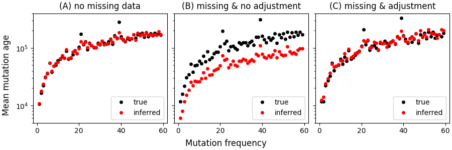
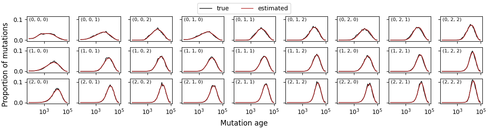

This is a Snakemake workflow for running
[SINGER](https://github.com/popgenmethods/singer) (MCMC sampling of ancestral
recombination graphs) in parallel, loosely based on the python wrappers
included with the binary. The genome is discretized into chunks, and SINGER is
run on each chunk with parameters adjusted to account for missing sequence and
recombination rate heterogeneity.  Chunks are merged into a single tree
sequence per chromosome and MCMC replicate. Some diagnostic plots are produced
at the end, that compare summary statistics to their expectations given the ARG
topology. Pair coalescence rates are calculated from the tree sequences and
plotted. 

Please cite SINGER (https://doi.org/10.1101/2024.03.16.585351) and POLEGON
(https://doi.org/10.1101/2025.02.14.638385) if you use this pipeline. Note that
I'm not one of the authors of SINGER, and put this pipeline together for my own
research, so *caveat emptor*.

### Dependencies

Using `git` and `mamba`:

```bash
git clone https://github.com/nspope/singer-snakemake my-singer-run && cd my-singer-run
mamba env create -f environment.yaml 
mamba activate singer-snakemake-env
snakemake --cores=20 --configfile=config/example_config.yaml
```

### Inputs

The input files for each chromosome are:

  - __\<chromosome_name>.vcf.gz__ gzip'd VCF that can be used as SINGER input, either diploid and **phased** or haploid with an even number of samples. This should represent an unbiased sample of segregating variation in the population (no ascertainment bias).
  - __\<chromosome_name>.mask.bed__ (optional) bed file containing inaccessible intervals. These are intervals that a priori could not be sequenced reliably. For example, these might be structural variants that are missing in some of the samples. Post-hoc filtered SNPs should go in a separate file, described below.
  - __\<chromosome_name>.hapmap__ (optional) recombination map in the format described in the documentation for `msprime.RateMap.read_hapmap` (see [here](https://tskit.dev/msprime/docs/stable/api.html#msprime.RateMap.read_hapmap))
  - __\<chromosome_name>.meta.csv__ (optional) csv containing metadata for each sample in the VCF, that will be inserted into the output tree sequences. The first row should be the field names, with subsequent rows for every sample in the VCF. The column pointed to by the `stratify-by` argument in the config will be used to fill out population information in the tree sequence.
  - __\<chromosome_name>.filter.txt__ (optional) text file containing 1-based positions of omitted SNPs (one per line). These may be present in the VCF (in which case they are removed by the pipeline) or not (in which case they are still used to calculate an adjustment to mutation rate, see below). For example, these might be SNPs that could not be called accurately in some samples, or where the ancestral state could not be reliably determined.

see the examples in `example/*` (generated by `resources/scripts/simulate-data.py`). 
It's a good idea to run chromosome arms separately, so that the chunks flanking
the centromere don't have long stretches of missing data.

### Config

A template for the configuration file is in `configs/example_config.yaml`:

```yaml
# --- example_config.yaml ---
input-dir: "example" # directory with input files per chromosome, see README
output-dir: "results" # directory where to place output
chromosomes: null # a list of chromosomes to use (e.g. "chr1"), if `null` use all `vcf.gz` in `input-dir`
mutation-rate: 1.0e-8 # per base per generation mutation rate
recombination-rate: 1.0e-8 # per base per generation recombination rate, ignored if hapmap is present
polarised: True # are variants polarised so that the reference state is ancestral
stratify-by: "population" # column in metadata to use for population table in tree sequence (or `null`)
random-seed: 1 # random seed
# --- discretization options ---
max-chunk-size: 1.0e6 # target size in base pairs for each chunk run through SINGER
min-chunk-size: 0.1e6 # discard chunks smaller than this (e.g. isolated between gaps)
min-gap-size: 1.0e6 # minimum size in base pairs for a masked interval to be converted to a gap
max-missing: 0.8 # ignore chunks with more than this proportion of masked sequence or filtered variants
min-sites: 500 # ignore chunks with fewer than this number of accessible polymorphic sites
min-branch-length: 1.0e-7 # minimum possible branch length in generations in tree sequence
# --- SINGER options ---
singer-mcmc-samples: 100 # number of MCMC samples (each sample is a tree sequence)
singer-mcmc-thin: 10 # thinning interval between MCMC samples
singer-mcmc-burnin: 0.5 # proportion of initial samples discarded when computing plots of statistics
singer-mcmc-resumes: 1000 # maximum number of times to try to resume MCMC on error
# --- POLEGON options ---
polegon-mcmc-samples: 100 # number of MCMC samples for POLEGON dating
polegon-mcmc-thin: 10 # thinning interval between MCMC samples for POLEGON dating
polegon-mcmc-burnin: 0.5 # proportion of initial samples trimmed from posterior mean for POLEGON dating
polegon-scaling-reps: 5 # number of timescale rescaling reps after MCMC sampling for POLEGON dating
polegon-max-step: 10.0 # step size used in proposal for POLEGON dating
# --- summary statistics ---
stats-time-grid: [1, 7, 25]  # [log10 start, log10 stop, number of intervals] for coalescence rates, etc
stats-window-size: 5.0e4 # size of genomic windows in base pairs for comparing expected vs observed
```

### Missing data, mutation rate, and dating ancestors

TODO: this is out-of-date

Missing data must be taken into account for the ages of nodes in the ARG to be
on the correct timescale. For example, if the sequence has a large amount of
missingness, an unadjusted molecular clock will result in estimates of node
(ancestor) ages that are substantially younger than the truth (because fewer
mutations implies less branch area). Hence, one way to account for missing
data is to locally adjust the mutation rate.

There are two sorts of missingness that are relevant: inaccessible intervals
(e.g. highly repetitive regions where variants cannot be called) and filtered
variants (e.g. "real" variants that are removed for one reason or another, such
as absence of ancestral state, missing genotypes, etc.). This pipeline
adjusts the global mutation rate within each chunk, 
```
mutation_rate[chunk] = (
  mutation_rate * 
  (accessible_sequence_length[chunk] / total_sequence_length[chunk]) * 
  (retained_variants[chunk] / total_variants[chunk])
)
``` 
where the last term is calculated considering only those variants in accessible
intervals. 

This sort of crude adjustment works best when bases/variants are missing
completely at random (e.g. not too clustered along the sequence). For instance,
the figure below compares the average mutation ages between the true ARG (for
the data in `example/*`), and inferred ARGs where: (A) there is
no missing data; (B) around 60% of the sequence is masked in intervals of
average length 800bp, but the mutation rate is not adjusted; (C) the mutation
rate is adjusted to account for missing data using the scheme above.



In all three cases, expected and observed summary statistics are a good match;
the problem with (B) is that the bias introduced by missing data has been absorbed 
into node ages rather than mutation rate.
An important consequence is that when calculating expectations of (linear) site
statistics from branch statistics in the ARG (e.g. `mode='site'` and
`mode='branch'` in ``tskit``'s stats methods), then the contribution from each
chunk must be weighted by the adjusted mutation rate and then summed across
chunks to get the correct values. Some examples of this sort of calculation
can be seen in `workflow/scripts/tree_statistics.py`. The adjusted mutation
rates are saved as an ``msprime.RateMap`` object (see below).

Similarly, to calculate sequence-wide distributions of coalescence time or
other topological statistics, the contribution of each chunk should be
weighted by the proportion of accessible sequence.


### Outputs

The output files for each chromosome will be generated in `results/<chromosome_name>`:

  - __trees/\<chromosome_name>.\<replicate>.tsz__ : a tree sequence MCMC replicate generated by SINGER, compressed by ``tszip`` (e.g. use ``tszip.decompress`` to load)
  - __\<chromosome_name>.recomb_rate.p__ : `msprime.RateMap` containing fine-scale recombination rates
  - __\<chromosome_name>.mut_rate.p__ : `msprime.RateMap` containing fine-scale adjusted mutation rates (see description above)
  - __\<chromosome_name>.inaccessible.p__ : `msprime.RateMap` containing fine-scale proportion of inaccessible bases (see description above)
  - __\<chromosome_name>.filtered.p__ : `msprime.RateMap` containing proportion of filtered variants (see description above)
  - __\<chromosome_name>.chunks.p__ : `msprime.RateMap` containing chunk boundaries (rate is zero if filtered) 
  - __\<chromosome_name>.windows.p__ : `msprime.RateMap` containing windowed statistics boundaries (rate is zero if filtered) 
  - __\<chromosome_name>.vcf.stats.p__ : "observed values" for summary statistics (e.g. calculated from with `scikit-allel`)
  - __\<chromosome_name>.vcf__ : filtered VCF used as input to SINGER
  - __chunks/*__ the raw SINGER output and logs
  - __plots/pair-coalescence-pdf.png__, __plots/cross-coalescence-pdf.png__: pair coalescence time distribution for all samples and between strata (if supplied), with a thin line for each MCMC replicate and a thick line for the posterior mean
  - __plots/pair-coalescence-rates.png__, __plots/cross-coalescence-rates.png__: pair coalescence rates for all samples and between strata (if supplied), with a thin line for each MCMC replicate and a thick line for the posterior mean
  - __plots/diversity-trace.png__, __plots/tajima-d-trace.png__ : MCMC trace for fitted nucleotide diversity and Tajima's D
  - __plots/diversity-scatter.png__, __plots/tajima-d-scatter.png__ : observed vs fitted nucleotide diversity and Tajima's D, across chunks
  - __plots/diversity-skyline.png__, __plots/tajima-d-skyline.png__ : observed and fitted nucleotide diversity and Tajima's D, across genome position
  - __plots/frequency-spectrum.png__ : observed vs fitted site frequency spectra, folded or unfolded depending on whether data is polarised
  - __plots/repolarised-trace.png__ : MCMC trace showing proportion of flipped ancestral states
  - __plots/mutational-load.png__ : number of derived mutations per haplotype (should be equal in expectation)
  - __plots/site-density.png__ : sanity check showing proportion of missing data, proportion variant bases (out of accessible bases), average recombination rate across chunks
  - __stats/\<chromosome_name>.\<replicate>.stats.p__ : "fitted values" for summary statistics (e.g. statistics from mutations simulated conditional on the ARG)
  - __stats/\<chromosome_name>.\<replicate>.coalrate.p__ : pair coalescence rates (e.g. inverse of haploid Ne) within logarithmic time bins, using all samples
  - __stats/\<chromosome_name>.\<replicate>.crossrate.p__ : cross coalescence rates within logarithmic time bins, between and within strata (e.g. populations) according to the `stratify-by` option in the config file


### Sanity checking

To check that the inference pipeline works (especially with a realistic pattern of missing data), the
Snakemake script `workflow/validation.smk` (config template at
`config/validation_stdpopsim.yaml` and `config/validation_msprime.yaml`) creates some visual comparisons for simulated data:

  1. Simulate from a given `stdpopsim` or `demes` model with intervals and variants randomly masked;
  2. Infer ARGs from the simulated data with SINGER;
  3. Calculate the distribution of mutation ages for each possible frequency (e.g. AFS bin), averaging over MCMC replicates;
  4. Smooth by projecting to a subsample (e.g. bins in a smaller AFS) by hypergeometric sampling;
  5. Plot alongside the true (simulated) mutation age distributions.

For example, from the human demographic model `"OutOfAfrica_3G09"` projected to a single diploid
in each of YRI, CEU, and CHB:



Where plot labels are `(frequency in YRI, in CEU, in CHB)`, and the monomorphic bins
`(0, 0, 0)` and `(2, 2, 2)` exist because of down-projection (i.e. mutations
which have zero frequency in a subsample of two haploids, taken from some larger sample).

